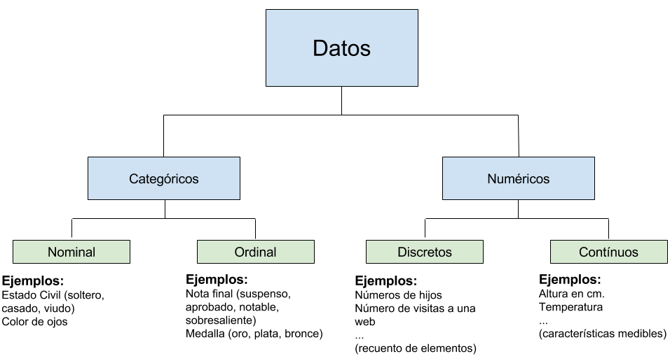

# Estadística descriptiva univariante

##	Conceptos generales

  **¿Qué es la Estadística?** 
  
   + Se considera un método utilizado para recoger, organizar, concentrar, reducir, presentar, analizar, generalizar y contrastar los resultados numéricos (datos) de observaciones directas o indirectas de fenómenos reales, así como de la información obtenida a partir de la experimentación, para estar en condiciones de llevar a cabo tanto evaluaciones como conclusiones adecuadas, y tomar decisiones acertadas y confiables. 
   
   
 La Estadística es la Ciencia de la 
 
 + Sistematización, recogida, ordenación y presentación de datos (**DESCRIPTIVA**) referentes a un fenómeno que presenta variabilidad o incertidumbre (aleatorio), con objeto de 
 
 + deducir las leyes que rigen esos fenómenos (**PROBABILIDAD**), y
 
 + y poder de esa forma hacer previsiones sobre los mismos, tomar decisiones y obtener conclusiones (**INFERENCIA**).
 


**Deficiones básicas**

+ **Población:** es la colección completa de todos los elementos de interés que se investigan. $N$ representa el tamaño de la población. *Ejemplo:* el nombre de todos los votantes de la Union Europea, ingresos de todas las familias de Bizkaia, Nota media de las notas de todos los alumnos que han accedido a la Universidad el curso 2017/2018. 

+ **Muestra:** es un subconjunto observado de la población. $n$ representa el tamaño muestral.

+ **Un parámetro** es una característica específica de una población (fija).

+ Un **estadístico** es una característica específica de una muestra (puede variar entre diferentes muestras).

+ Un **muestreo aleatorio simple** es un procedimiento en el que 

    + cada miembro de la población se elige al azar, 
    + cada miembro de la población tiene la misma posibilidad de ser elegido, 
    + cada posible muestra de elementos tiene la misma probabilidad de ser elegida.


+ **Variable** es una característica observable que *varía* entre los diferentes individuos de una población. *Ejemplos:* Tiempo de vida de una piezas, Número de piezas fabricadas por una máquina, Calidad de las piezas fabricadas (Buena, Regular, Mala).


+ **Datos** son los valores reales que toma la variable.


## Tipos de variables o datos

**Variable cualitativa**

Las *variables cualitativas* se refieren a características o cualidades que no pueden ser medidas con números. Podemos distinguir dos tipos:

  + **Variable cualitativa nominal**

Una variable cualitativa nominal presenta modalidades no numéricas que no admiten un criterio de orden. Por ejemplo: el estado civil (soltero, casado, viudo).

  + **variable cualitativa ordinal** 
  
Una variable cualitativa ordinal presenta modalidades no númericas, en las que existe un orden. Por ejemplo: la nota en un examen: suspenso, aprobado, notable, sobresaliente. Medallas de una prueba deportiva: oro, plata, bronce.

**Variable cuantitativa**

Una variable cuantitativa es la que se expresa mediante un número, por tanto se pueden realizar operaciones aritméticas con ella. Podemos distinguir dos tipos:

  + **Variable cuantitativa discreta**

Una variable discreta es aquella que solo puede tomar un número finito de valores entre dos valores cualesquiera de una caraterística. Por ejemplo: el número de hermanos de 5 amigos: 2, 1, 0, 1, 3.

  + **Variable cuantitativa continua**

Una variable continua es aquella que puede tomar un número infinito de valores entre dos valores cualesquiera de una caraterística. Por ejemplo: la altura de los 5 amigos: 1.73, 1.82, 1.77, 1.69, 1.75.



 
##	Descripción de un conjunto de datos

**Representación de datos**

Datos en bruto en forma de listas u hojas de cálculo no son fáciles de usar para tomar decisiones. Es necesaria algún tipo de organización:

  + Tablas

  + Gráficos (dependen del tipo de variable que se quiere resumir)
  

**Variables categóricas**

  + Distribuciones de frecuencias 
  
  + Diagrama de barras
  
  + Diagrama de tarta

**Variables numéricas**

  + Distribución de frecuencias
  
  + Histograma
  
  + Diagrama de caja (*box-plot*)
  

**Ejemplo:** Nº de pacientes en un hospital según servicio

```{r,warning=FALSE,echo=FALSE}
hospitales <- read.csv("data/hospitales.csv",header=TRUE)
library(knitr)
kable(hospitales)
```


`Tipo` es una variable categórica (nominal) que toma valores 1,...5, sin embargo cada valor corresponde a un `Servicio` (`Cardiología`, `Cirugía`, `Emergencias`, `UCI`, `Maternidad`)

El número total de pacientes es `r sum(hospitales$Nº.Pacientes)`

```{r,echo=FALSE}
Total_pacientes <- sum(hospitales$Nº.Pacientes)
hospitales$Proporcion <- (hospitales$Nº.Pacientes/Total_pacientes)*100
kable(hospitales, caption="Nº de pacientes en un hospital según servicio, Proporcion de pacientes por Servicio (%100)",digits=2,format="markdown")
```

```{r,echo=FALSE,fig.width=10,fig.height=6,fig.cap="Diagramas de barra y de tarta"}
par(mfrow=c(1,2))
barplot(hospitales[,3],legend = levels(hospitales$Servicio),col=2:6,main="Diagrama de barras")
pie(hospitales[,3],labels = levels(hospitales$Servicio),col=2:6, main="Diagrama de tarta")
```


## Distribuciones de frecuencias


Exponen la información recogida en la muestra, de forma que no se pierda nada de información (o poca).

  + **Frecuencias absolutas ($n_i$):** Contabilizan el número total ($n = \sum_i n_i$) de individuos de cada clase

  + **Frecuencias relativas (porcentajes):** Es la proporción de individuos que pertenecen a dicha clase sobre el total de individuos de la muestra. Se obtiene dividiendo la anterior por el total. $f_i=\frac{n_i}{n}$

  + **Frecuencias acumuladas:** Sólo tienen sentido para variables ordinales y numéricas. Se obtienen sumando las frecuencias de las clases anteriores.

**Ejemplo:** *Número de averías de 40 centrales eléctrica*

Los datos sobre el número de averías de 40 centrales eléctricas y su tabla de frecuencias. Los datos se recogen en la siguiente tabla:

```{r,echo=FALSE}
centrales <- data.frame(averias = c(0,1,2,3,4), Frec. = c(13,13,8,5,1))
#kable(centrales)
centrales$Frec.Rel <- centrales$Frec./sum(centrales$Frec.)
centrales$Frec.Acum <- cumsum(centrales$Frec.)
centrales$Frec.Rel.Acum <- cumsum(centrales$Frec.Rel)
kable(centrales)
```

  + ¿Cuántas centrales tienen menos de dos averías?
  
  + ¿Qué porcentaje de centrales tiene 3 ó menos averías?
  
  + ¿Qué cantidad de averías es tal que al menos el 50% de las centrales tiene una cantidad de averías inferior o igual a esa?


**Representaciones gráficas**

Algunos gráficos son diferentes en función de que las variables sean discretas o continuas. Se utilizan con frec. absolutas o relativas.

  + Cada barra representa una clase

  + Se deja un hueco entre barras para indicar los valores que no son posibles 
  
  + La altura corresponde a la frecuencia absoluta o relativa de la clase


```{r,echo=FALSE, fig.width=10,fig.height=6, fig.cap="Diagrama de Barras (Frec. Absoluta y Abs Acumulada)"}
par(mfrow=c(1,2))
barplot(centrales$Frec., names.arg = as.factor(centrales$averias),col="lightblue",main="Diagrama de Barras Frec. Absolutas")
barplot(centrales$Frec.Acum, names.arg= as.factor(centrales$averias), col="lightblue",main="Diagrama de Barras Frec. Abs Acumuladas")
```


**Ejemplo:** A continuación, se presentan las alturas de 28 alumnos de una clase


```{r,echo=FALSE}
set.seed(123)
altura <- round(rnorm(28,mean=173,sd=2),2)
```


```
171.88	173.26	171.63	173.80	174.00	170.86	171.75
172.54	176.43	172.11	173.22	169.07	172.56	169.63
176.12	173.92	175.45	171.89	174.40	170.95	174.68
173.14	170.47	173.72	176.57	172.05	171.54	173.31
```

Gráficamente, podemos representar los datos a través de un histograma. El **histograma** es una representación gráfica de una variable en forma de barras, donde la superficie de cada barra es proporcional a la frecuencia de los valores representados. Sirven para obtener una "primera vista" general, o panorama, de la distribución de la población, o de la muestra, respecto a una característica, cuantitativa y continua (como la longitud o el peso).

```{r, echo=FALSE, fig.width=6, fig.cap="Histograma de alturas", fig.align='center'}
h <- hist(altura,col="lightgrey",main = "Histograma")
```

El histograma divide el rango de las alturas en intervalos y cuenta el número de observaciones en casa intervalo (frecuencia absoluta), en este caso `r h$counts`.


```{r,echo=FALSE,fig.cap="¿Qué información podemos obtener de un histograma?"}
par(mfrow=c(2,2))
set.seed(123)
N <- 10000
 x <- rbeta(N, 5, 5)
 hist(x,breaks=20,probability = TRUE,
   col='lightblue', xlab=' ', ylab=' ', axes=F,
   main='Simetría')
lines(density(x,bw=0.08), col='red', lwd=3)
 
 x <- rnorm(100, m=2, sd=1)
 hist(c(x,rep(15,10)),breaks=20,probability = TRUE,
   col='lightblue', xlab=' ', ylab=' ', axes=F,
   main='Valores Atípicos')
 
 x <- rbeta(N, 2, 8)
 hist(x,breaks=20,probability = TRUE,
   col='lightblue', xlab=' ', ylab=' ', axes=F,
   main='Asimetría positiva')
lines(density(x,bw=0.08), col='red', lwd=3)

 x <- rbeta(N, 8, 2)
 hist(x,breaks=20,probability = TRUE,
   col='lightblue', xlab=' ', ylab=' ', axes=F,
   main='Asimetría negativa')
lines(density(x,bw=0.08), col='red', lwd=3)
```


##	Medidas de posición y dispersión 

Recordemos:

  + **Parámetro:** Es una cantidad numérica calculada sobre una población 

      - La vida media de las bombillas de 60 W

      - La idea es resumir la información que hay en la población en unos pocos números (parámetros).


  + **Estadístico:** Es una cantidad numérica calculada sobre una muestra 

      - La vida media de las bombillas de 60 W de mi casa.
      
      - Son una muestra (¿representativa?) de la población.

      - Si un estadístico se usa para aproximar un parámetro también se le suele llamar estimador.


Normalmente nos interesa conocer un parámetro, pero por la dificultad que conlleva estudiar a TODA la población, calculamos un estimador sobre una muestra y "confiamos" en que sean próximos.


### Posición o centralización
  
  + Proporcionan un valor simple y representativo, que resume un gran volumen de información.
  
  + Indican valores respecto a los que los datos parecen agruparse (ejemplos: media, mediana y moda).
    
  + Dividen un conjunto ordenado de datos en grupos con la misma cantidad de individuos (ejemplos: cuantiles, percentiles, cuartiles, ...)

**Media**

Es la media aritmética de los valores de una variable. Conveniente cuando los datos se concentran simétricamente con respecto a ese valor. Muy sensible a valores extremos. Centro de gravedad de los datos

**Mediana**

Es un valor que divide a los datos en dos grupos con el mismo número de individuos. Es conveniente cuando los datos son asimétricos. No es sensible a valores extremos.


**Moda**

Es el valor donde la distribución de frecuencia alcanza un máximo (no tiene por qué ser un valor único).


**Cuantil de orden $\alpha$**

Se define como un valor de la variable por debajo del cual se encuentra una frecuencia relativa acumulada $\alpha$.

Casos particulares son los percentiles, cuartiles,...

  * **Percentil** 
  
  $$
    \mbox{Percentil de orden $k$} = \mbox{cuantil de orden $k$}/100
  $$
  
La mediana es el percentil 50
    
El percentil de orden 10 deja por debajo al 10\% de las observaciones y por encima al 90\%


  * **Cuartil** 
  
  Dividen a la muestra en 4 grupos con frecuencias similares.
  
    Primer cuartil  = Percentil 25 = Q1
    Segundo cuartil = Percentil 50 = Q2 = mediana
    Tercer cuartil  = Percentil 75 = Q3
  

  
### Dispersión

Indican la mayor o menor concentración de los datos con respecto a las medidas de centralización (ejemplos: desviación típica, rango, varianza)
    

* **Varianza** 

Mide el promedio de las desviaciones (al cuadrado) de las observaciones con respecto a la media    
    
$$
S^2 = \frac{1}{n}\sum_{i=1}^{n}(x_i - \bar{x})^2
$$

o si los datos están en formato tabla de frecuencias

$$
S^2 = \frac{1}{n}\sum_{i=1}^{n}f_i (x_i - \bar{x})^2  = \frac{\sum_{i=1}^{n}x_i^2 f_i}{n}  - \bar{x}^2
$$

donde $\bar{x} = \frac{\sum_{i=1}^{n}x_i f_i}{n}$


\medskip


*Propiedades de la varianza*:

  1. La varianza es siempre un valor positivo o cero (es cero cuando todos los valores son idénticos). $\mbox{Var}(X) \geq 0$
  2. $\mbox{Var}(b) = 0$, , para todo número real $b$ (i.e. $b$ una constante).
  3. $\mbox{Var}(a X) = a^2 \mbox{Var}(X)$, para todo número real $a$.
  4. $\mbox{Var}(a X + b) = a^2 \mbox{Var}(X)$.
  5. $\mbox{Var}(X + Y) = \mbox{Var}(X) + \mbox{Var}(Y)$, únicamente en el caso de que $X$ e $Y$ sean variables aleatorias independientes.

\medskip

* **Desviación típica**

Es la raíz cuadrada de la varianza, $S = \sqrt{S^2}$


Se verifica que entre la media y $k$ veces la desviación típica se encuentran como mínimo el
$$
  100 \times (1- \frac{1}{k^2}) \% \mbox{ de las observaciones} \tag{``Teorema de Chebyshev''}
$$

**Ejemplo**

Supongamos una variable con media $\bar{x} = 686$ y desviación típica $s=25$, centrado en la media y a $k=2$ desviaciones típicas de distancia. Entre 


$$
       (686- 2\times 25,686+ 2\times 25) = (636,736)
$$
se encuentra al menos el $100\times \left(1-\frac{1}{2^2} \right)\% = 75\%$ de las observaciones.


```{r, echo=FALSE}
set.seed(123)
   mu <- 686
sigma <- 25
x <- rnorm(1000,mean=686,sd=25)
hist(x,20,col="lightgrey",xlab="")
abline(v=c(mu-2*sigma,mu+2*sigma),col="red")
```


**Coeficiente de variación**
Es una medida relativa de la variabilidad. Compara la media y la desviación típica. Es adimensional

  $$
        \mbox{CV} = \frac{s}{\bar{x}}
  $$
Se puede usar para comparar dos o más conjuntos de datos, medidos en diferentes unidades

**Ejemplo:**

  * *Stock A:* 
  
      + Precio medio último año = 50 euro
      
      + Desviación típica = 5 euro
  
  * *Stock B:*

      + Precio medio último año = 100 euro
      
      + Desviación típica = 5 euro
      
Ambos stocks tienen la misma desviación típica de 5 euros. Si calculamos CV

$$
    CV_{A} = \frac{s}{\bar{x}}\times 100\% = \frac{5}{50} \times 100\% = 10\% \qquad  CV_{B} = \frac{s}{\bar{x}}\times 100\% = \frac{5}{100} \times 100\% = 5\%
$$

el stock B es menos variable en relación a su precio.

**Rango**
Mide el grado de dispersión independientemente de las causas. Es la distancia entre las observaciones extremas

$$
    \mbox{Rango}(x)  = \max{x_i} - \min{x_i}
$$


### Asimetría y Curtosis

  + **Asimetría:** es una medida de forma de una distribución que permite identificar y describir la manera como los datos tiende a reunirse de acuerdo con la frecuencia con que se hallen dentro de la distribución. Permite identificar las características de la distribución de datos sin necesidad de generar el gráfico. Una medida de asimetría es el *Coeficiente de Pearson:*
        $$
            AS = \frac{3 (\bar{x} - med(x))}{s}
        $$
donde $\bar{x}$ es la media, $med$ la mediana y $s$ la desviación típica. El coeficiente de asimetría de Pearson varía entre $-3$ y $3$: i) si $AS<0$ la distribución será asimétrica negativa; ii) si si $AS=0$ la distribución será simétrica; iii) si $AS>0$ la distribución será asimétrica positiva.


   + **Curtosis o apuntamiento:** La curtosis mide el grado de agudeza o achatamiento de una distribución con relación a la distribución normal, es decir, mide cuán puntiaguda es una distribución. La curtosis determina el grado de concentración que presentan los valores en la región central de la distribución. Así puede ser: 
   
      * Leptocúrtica.- Existe una gran concentración.

      * Mesocúrtica.- Existe una concentración normal.

      * Platicúrtica.- Existe una baja concentración.
   
```{r, echo=FALSE, fig.width=10,fig.height=6, warning=FALSE, message=FALSE}
set.seed(1234)
library(fBasics)
library(rmutil)
x <- seq(-7,7,l=1000)

  y0 <- dnorm(x,0,1)
ypos <- dlaplace(x, 0, 1)#dt(x,df=.5)
yneg <- dnorm(x,0,2.5)
plot(x,y0, ylim=c(0,.5),t="l",col=1,lwd=3,axes=FALSE,xlab="",ylab="")
lines(x,ypos,col=2,lwd=2)
lines(x,yneg,col=3,lwd=2)
legend("topright", c("Normal Distribution (mesocúrtica)", "Kurtosis Positiva (leptocúrtica)", "Kurtosis Negativa (platicúrtica)"), col=c(1,2,3),lwd=3,lty=1)
```
   
##	Transformaciones


En algunas ocasiones es útil transformar los datos o expresarlos en otras unidades. 


**Transformaciones lineales: $Y = a + bX$**

La tipificación de variables resulta muy útil para eliminar su dependencia respecto a las unidades de medida empleadas. En realidad, una tipificación equivale a una transfor-mación lineal
    $$
        Z = \frac{X-\bar{x}}{s}  = \frac{1}{s}X - \frac{\bar{x}}{s}
    $$
siendo $Z = a + bX$ con $a=\frac{\bar{x}}{s}$ y $b=\frac{1}{s}$.
    
La variable tipificada expresa el número de desviaciones típicas que dista de la media cada observación. Por ello, se puede comparar la posición relativa de los datos de diferentes distribuciones.
    
Otra situación habitual se presenta cuando se hace un cambio de unidades de medida. A pesar de las buenas propiedades de las transformaciones lineales, éstas no son suficientes para modificar rasgos más complejos de una distribución como por ejemplo la asimetría.
Para hacer más simétrica una distribución se deben hacer transformaciones no lineales.

**Transformaciones no-lineales**


Como regla general, se trata de escoger una transformación que conduzca a una distribución simétrica, y más cercana a la distribución normal. De este modo, se pueden aplicar numerosas técnicas de inferencia estadística.

Cuando se tienen distribuciones de frecuencias con asimetría negativa (frecuencias altas hacia el lado derecho de la distribución), es conveniente aplicar la transformación $y=x^2$. Esta transformación comprime la escala para valores pequeños y la expande para valores altos. Para distribuciones asimétricas positivas se usan las transformaciones $\sqrt{x}$, $\mbox{Ln}(x)$, $y=1/x$, que comprimen los valores altos y expanden los pequeños.

```{r,echo=FALSE,fig.width=8, fig.height=6, fig.cap="Ejemplos de transformaciones de variables"}
par(mfrow=c(2,2))
set.seed(123)
N <- 10000

 x <- rbeta(N, 4, 2)
 hist(x,breaks=10,probability = TRUE,
   col='lightgrey', xlab=' x ', ylab=' ', axes=F,
   main='Histograma inicial\n y')

 hist(x^2,breaks=10,probability = TRUE,
   col='lightgrey', xlab=' y ', ylab=' ', axes=F,
   main='Histograma transformado\n y=x^2')
 
 x <- rbeta(N, 2, 4)
 hist(x,breaks=10,probability = TRUE,
   col='lightgrey', xlab=' x ', ylab=' ', axes=F,
   main='Histograma inicial\n y')

 hist(sqrt(x),breaks=10,probability = TRUE,
   col='lightgrey', xlab=' y ', ylab=' ', axes=F,
   main='Histograma transformado\n y=sqrt(x)')
 
 #  x <- rpois(N, 20)
 # hist(x,breaks=10,probability = TRUE,
 #   col='lightgrey', xlab=' x ', ylab=' ', axes=F,
 #   main='Histograma inicial\n y')
 # 
 # hist(log(x),breaks=10,probability = TRUE,
 #   col='lightgrey', xlab=' y ', ylab=' ', axes=F,
 #   main='Histograma transformado\n y=Ln(x)')
```

La transformación más utilizada es la del logaritmo. Muchas distribuciones de datos económicos, o de consumos se convierten en simétricas al tomar la transformación logaritmo. Supongamos que queremos estudiar el crecimiento del consumo de energía en diferentes países. Una opción consiste en en estudiar las diferencias de consumo entre dos instantes de tiempos $C_t - C_{t-1}$, pero en general resulta más conveniente considerar las diferencias relativas:

$$
    \frac{C_t  - C_{t-1}}{C_t} \quad\mbox{o bien}\quad \frac{C_t  - C_{t-1}}{C_{t-1}}
$$

Una medida más adecuada consiste en tomar logaritmos

$$
\mbox{Ln}C_t - \mbox{Ln}C_{t-1} = \mbox{Ln}\frac{C_t}{C_{t-1}} = \mbox{Ln}\left( 1 + \frac{C_t - C_{t-1}}{C_{t-1}}\right)  \approx \frac{C_t - C_{t_1}}{C_{t-1}}
$$

ya que $\mbox{Ln}(1+x) = x$, para valores de $x$ pequeños.

Así, si se expresa la variable en logaritmos, su crecimiento en dicha escala es una buena medida del crecimiento relativo.

Por otro lado, dado que $C_t \geq C_{t-1}$, entonces
$$
 \frac{C_t-C_{t-1}}{C_{t}} \leq \mbox{Ln} \frac{C_t}{C_{t-1}}\leq \frac{C_t-C_{t-1}}{C_{t-1}}
$$
de modo que las diferencias de las variables transformadas por un logaritmo, son una medida promedio de las dos formas posibles de medir el crecimiento relativo.


```{r, echo=FALSE, fig.width=10, fig.height=8, fig.cap = "Ejemplo de transformación logarítmica", fig.align='center'}
x <- c(2.2, 7.6, 2.9, 4.6, 4.1, 3.9, 7.4, 3.2, 5.1, 5.3, 20.1, 2.3, 5.5, 32.7, 9.1, 1.7, 3.2, 5.8,16.3, 15.9, 5.9, 6.7, 3.4, 40.5)
par(mfrow=c(2,2))
hist(x,col="lightgrey")
hist(log(x),col="lightgrey")
boxplot(x,col="lightgrey",horizontal = TRUE, xlab="x")
boxplot(log(x),col="lightgrey",horizontal = TRUE, xlab="Ln(x)")
```


## Estadística descriptiva univariante con `R`

A continuación vamos a utilizar `R` para realizar la estadística descriptiva de los datos de ejemplo que hemos utilizado en esta sección.

**Ejemplo:** *Nº de paciences en un hospital según servicio*
```{r, echo=TRUE}
# Leer los datos de un fichero .csv
pacientes <- read.csv("data/hospitales.csv",header=TRUE)
class(pacientes) # clase del objeto
  str(pacientes) # estructura
pacientes
```

*Tabla de frecuencias relativas*

El símbolo `$` es un commando básico en `R`, permite crear nuevas variables en un `data.frame` o acceder a los elementos de un `data.frame` o de una lista. Veremos el uso de `$`en numerosas ocasiones. 

A continuación, creamos la columna (o variable) `Proporcion` como la frecuencia relativa (en $\% 100$).


```{r}
names(pacientes)
Total_pacientes <- sum(pacientes$Nº.Pacientes)
pacientes$Proporcion <- (pacientes$Nº.Pacientes/Total_pacientes)*100
pacientes
names(pacientes)
```


Diagrama de barras `barplot` y diagrama de tarta `pie` (**Figura 2**). Ver más detalles en `?barplot` y `?pie`.

```{r,eval=FALSE}
par(mfrow=c(1,2))
barplot(pacientes[,3],legend = levels(pacientes$Servicio),
        col=2:6,main="Diagrama de barras")
pie(pacientes[,3],labels = levels(pacientes$Servicio),
        col=2:6, main="Diagrama de tarta")
```

**Ejemplo:** *Nº de averías en 40 centrales eléctricas*

El comando `cumsum` calcula la *suma acumulada* de un vector y nos permite calcular las frecuencias acumuladas (ver ayuda `?cumsum`)

```{r,eval=TRUE}
# Creamos la tabla
centrales <- data.frame(averias = c(0,1,2,3,4), Frec. = c(13,13,8,5,1))
centrales
centrales$Frec.Rel <- centrales$Frec./sum(centrales$Frec.)
centrales$Frec.Acum <- cumsum(centrales$Frec.)
centrales$Frec.Rel.Acum <- cumsum(centrales$Frec.Rel)
centrales
```

Diagrama de barras de frecuencias absolutas y absolutas acumuladas (Ver **Figura 3**).


```{r,eval=FALSE}
par(mfrow=c(1,2))
barplot(centrales$Frec., 
        names.arg = as.factor(centrales$averias),col="lightblue",
        main="Diagrama de Barras Frec. Absolutas")
barplot(centrales$Frec.Acum, 
        names.arg= as.factor(centrales$averias), col="lightblue",
        main="Diagrama de Barras Frec. Abs Acumuladas")
```

**Ejemplo:** *Alturas de alumnos*

Introduce los datos de las alturas de 28 alumnos

```
171.88  173.26  171.63  173.80  174.00  170.86  171.75
172.54  176.43  172.11  173.22  169.07  172.56  169.63
176.12  173.92  175.45  171.89  174.40  170.95  174.68
173.14  170.47  173.72  176.57  172.05  171.54  173.31
```
Utiliza la función `c()` o `scan()`

```{r}
alturas <- c(171.88,  173.26,  171.63,  173.80,  174.00,  170.86,  171.75,
             172.54,  176.43,  172.11,  173.22,  169.07,  172.56,  169.63,
             176.12,  173.92,  175.45,  171.89,  174.40,  170.95,  174.68,
             173.14,  170.47,  173.72,  176.57,  172.05,  171.54,  173.31)
```

El comando `hist()` dibuja el histograma de la variable (ver `?hist` para más detalles)

```{r, fig.width=10,fig.height=8, fig.cap="Histograma de alturas con distinto número de intervalos de clase `breaks=`5,8,10,25"}
par(mfrow=c(2,2))
hist(alturas, col="lightblue", breaks = 5)
hist(alturas, col="lightblue", breaks = 8)
hist(alturas, col="lightblue", breaks = 10)
hist(alturas, col="lightblue", breaks = 25)
```

Podemos representar la densidad (*Kernel Density Estimation*) de los datos mediante la función `density` (ver `?density` para más detalles). Para ello, en `hist` tenemos que especificar `probability=TRUE` o bien `freq=FALSE`


```{r, fig.width=6,fig.height=4, fig.cap="Densidad ajustada al histograma de las alturas"}
hist(alturas, col="lightblue", probability = TRUE)
lines(density(alturas,bw="SJ"),col="red",lwd=2)
```

`summary()` es un función básica de `R` que permite resumir el objeto sobre el que se aplica. Para un vector numérico como es `alturas`, obtenemos

```{r}
summary(alturas)
```

O del mismo modo

  + El valor mínimo `min(alturas)` o máximo `max(alturas)`, o el rango `range(alturas)`
  + La media `mean(alturas)` o la mediana `median(alturas)`
  + Los cuantiles `quantile(alturas)`
  + Percentiles `quantile(alturas, probs = c(0.10,0.90))`
```{r}
mean(alturas)
range(alturas)
quantile(alturas)
quantile(alturas, probs = c(0.10,0.90))
```

Medidas de dispersión, como la varianza `var` y la desviación típica `sd`

```{r}
var(alturas)
 sd(alturas)
```

**NOTA:** `var` calcula la *varianza muestral* (que es el estimador insesgado de la varianza poblacional), es decir, divide entre $n-1$
$$
      \mbox{Var}(x) = \frac{\sum_{i=1}^n (x_i  - \bar{x})^2}{n-1}
$$
```{r}
n <- 28
sum((alturas - mean(alturas))^2)/(n-1)

```


La función `boxplot()` permite realizar un diagrama de caja sobre una variable contínua

```{r, fig.width=10,fig.caption="Función `boxplot` de alturas"}
par(mfrow=c(1,2))
boxplot(alturas, horizontal = TRUE,
        main= "Boxplot de alturas (en horizontal)", col="lightgrey")
boxplot(alturas, horizontal = FALSE, 
        main= "Boxplot de alturas (en vertical)", col="lightgrey")
```
