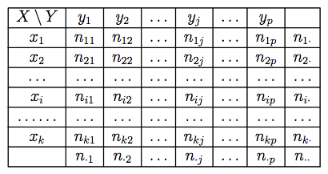

\newpage

[Regresar a la página principal](https://idaejin.github.io/datahack/)

#	Estadística descriptiva bivariante

En el tema anterior hemos visto cómo describir una muestra de datos de una variable mediante:

 + Representaciones gráficas 
 + Estadísticos (de posición, dispersión, etc ...)
 

En este tema consideraremos el caso de 2 variables. Nuestro interés será por tanto, saber si $Y$ es otra variable definida sobre la misma población que $X$, ¿será posible determinar si existe alguna relación entre $X$ e $Y$?

Ahora tomamos dos medidas a cada individuo de la muestra. Consideramos una población de $n$ individuos, donde cada uno de ellos presenta dos características que representamos mediante las variables $X$ e $Y$. 

Las variables pueden ser cuantitativas, discretas o continuas o cualitativas, dando lugar a muchas combinaciones:

  + cualitativa/cualitativa, discreta/continua, continua/continua, etc.

El tipo de análisis dependerá de la combinación que tengamos.

Tomamos una muestra de la población y medimos las variables ($X$ e $Y$), esa muestra estará dividida en clases para cada una de las variables y existirán elementos que pertenezcan a las distintas combinaciones de las clases.


##	Distribuciones de frecuencias 

Llamamos **distribución conjunta de frecuencias** de dos variables ($X$ e $Y$) a la tabla que representa los valores observados y las frecuencias relativas/absolutas de cada par.


###	Distribución conjunta

Consideramos una población de $n$ individuos, donde cada uno de ellos presenta dos caracteres que representamos mediante las variables
$X$ e $Y$. Representamos mediante:+

$$
X \rightarrow x_1,x_2,...,x_k
$$
las $k$ modalidades que presenta la variable $X$ y mediante
$$
Y \rightarrow y_1,y_2,...,y_p
$$
las $p$ modalidades de $Y$.


Con la intención de reunir en una sola estructura toda la información disponible, creamos una tabla formada por $k\times p$ casillas, organizadas de forma que se tengan $k$ filas y $p$ columnas. La casilla denotada de forma general mediante el subíndice $_{ij}$ hará referencia a los elementos de la muestra que presentan simultáneamente las modalidades $x_i$ e $y_j$.

<center>{width=65%}</center>


De este modo, para $i=1,...,k$,y para $j=1,...,p$,se tiene que $n_{ij}$ $ij$ es el número de individuos o frecuencia absoluta, que presentan a la vez las modalidades $x_i$ e $y_j$.


El número de individuos que presentan la modalidad $x_i$, es lo que llamamos frecuencia absoluta marginal de $x_i$ y se representa como
$n_{i\cdot}$, donde

$$
    n_{i\cdot} = n_{i1}+n_{i2} + ... + n_{ip} = \sum_{j=1}^{p} n_{ij}
$$

El símbolo $\cdot$ en $n_{i\cdot}$ simboliza que estamos considerando los elementos de $x_i$ independientemente de los valores de $Y$. De forma análoga, se define la frecuencia absoluta marginal de la modalidad $y_j$ como:
$$
    n_{\cdot j} = n_{1j}+n_{2j} + ... + n_{kj} = \sum_{i=1}^{k} n_{ij}
$$

**Propiedad**

$$
    n_{\cdot\cdot} = \sum_{i=1}^{k}\sum_{j=1}^{p} n_{ij}  = n
$$

### Distibución marginal

A la proporción de elementos (tanto por uno) que presentan simultáneamente las modalidades $x_i$ e $y_j$ la llamamos frecuencia relativa
$f_{ij}$

$$
    f_{ij} = \frac{n_{ij}}{n}
$$
siendo las frecuencias relativas marginales:

$$
      f_{i\cdot} = \sum_{j=1}^{p}f_{ij}\frac{n_{i\cdot}}{n}
$$
$$
      f_{\cdot j} = \sum_{i=1}^{k}f_{ij}\frac{n_{\cdot j}}{n}
$$

{width=65%}


**Propiedad**

$$
    f_{\cdot\cdot} = \sum_{i=1}^{k}\sum_{j=1}^{p} f_{ij} = 1
$$


###	Distribución condicionada

De todos los elementos de la población, $n$, podemos estar interesados, en un momento dado, en un conjunto más pequeño que está formado por aquellos elementos que han presentado la modalidad $y_j$,par aalgún $j=1,...,p$ .El número de elementos de este conjunto sabemos que es $n_{\cdot j}$. La variable $X$ definida sobre este conjunto se denomina variable condicionada y se suele denotar mediante $X|y_j$ o bien $X|Y=y_j$. 

La distribución de frecuencias absolutas de esta nueva variable es exactamente la columna $j$ de la tabla. Por tanto sus frecuencias relativas, que denominaremos frecuencias relativas condicionadas son

$$
    f_j^{i} = \frac{n_{ij}}{n_{\cdot j}} \mbox{ para todo $i= 1,...,k$}
$$

Del mismo modo, la variable condicionada $Y|x_i$ cuya distribución de frecuencias relativas condicionadas es:
$$
    f_i^{j} = \frac{n_{ij}}{n_{i\cdot}} \mbox{ para todo $j= 1,...,p$}
$$


##	Representaciones gráficas

Dependerá del tipo de variables con las que estemos trabajando y de si están agrupadas o no.

  *  Cualitativas , Cuantitativas discretas: 
  *  Cuantitativas continuas: 
  
  
### Diagramas de barras en 3 dimensiones para datos agrupados
  
  **Ejemplo (continua/continua), en datos agrupados:** A continuación se muestran los datos recogidos de medir la longitud (X en mm) y el peso (Y en gr) de una muestra de 117 tornillos producidos por una máquina.
  
  {width=85%}
  
```{r, echo=FALSE, fig.align='center', fig.width=10, fig.height=8, message=FALSE, warning=FALSE, fig.cap="Histograma en 3 dimensiones"}
library(plot3D)
 tornillos <- matrix(c(4,0,0,0,
                       14,60,2,0,
                       0,20,16,1),ncol=4,byrow=TRUE)
 colnames(tornillos) <- c("40-60","60-80","80-100","100-120")
 rownames(tornillos) <- c("140-160","160-180","180-200")
 tornillos <- as.table(tornillos)
 #tornillos
 VV = tornillos

 hist3D(z = VV, scale = FALSE, expand = 0.01, bty = "g", phi = 20,col = "#0072B2", border = "black", shade = 0.2, ltheta = 90,space = 0.3, ticktype = "simple", d = 2, zlab="Frequencies", xlab="Longitud", ylab="Peso")
```

  
  

### Diagrama de dispersión

La representación gráfica más útil para mostrar el tipo de relación entre dos variables continuas sin agrupar es el diagrama de dispersión, que representa cada par de puntos $(x_i,y_i)$, $i=1,...n$, en un plano cartesiano.

Supongamos que tenemos las 117 mediciones de los tornillos sin agrupar. La siguiente figura muestra un gráfico de dispersión, que nos permite intuir la relación entre el Peso y la Longitud.


```{r,echo=FALSE,fig.align="center",fig.cap="Gráfico de dispersión Longitud/Peso", fig.width=8,fig.height=6}
set.seed(123)
Peso <- runif(100,40,120)
Long <- runif(100,140,200)
Long <- 110+.15*Peso + rnorm(100,0,2)
plot(Long,Peso,ylab="Peso en gr", xlab="Longitud en mm",pch=19,col="blue")
```


```{r,echo=FALSE,fig.align="center",fig.cap="Tipos de relaciones X/Y en diagramas de dispersión", fig.width=12,fig.height=10}
set.seed(1)
x <- runif(100,40,120)
y <- runif(100,85,120)
par(mfrow=c(2,2))
plot(x,110+.23*x + rnorm(100,0,2),ylab="y", xlab="x",pch=19,col="blue", main="Relación lineal positiva")
plot(x,110-.15*x + rnorm(100,0,2),ylab="y", xlab="x",pch=19,col="blue", main="Relación lineal negativa")
plot(x,y,ylab="y", xlab="y",pch=19,col="blue", main="No hay relación")
x= rnorm(100)
plot(x,(x^2)+rnorm(100,1),ylab="y", xlab="x",pch=19,col="blue", main="Relación no-lineal")
```


##	Medidas de dependencia lineal

Las dos medidas más utilizadas para cuantificar el grado y el sentido de la dependencia lineal son: la covarianza y la correlación.


###	Covarianza

Nos indica si la relación entre las variables es positiva o negativa Su magnitud depende de las unidades

Cuando los datos están agrupados en forma de tabla:

$$
    S_{xy} = \sum_i \sum_j f_{ij}(x_i-\bar{x})(y_i-\bar{y}) = \sum_i \sum_j f_{ij}x_i y_j - \bar{x}\bar{y}
$$

*Ejercicio:* Supongamos la siguiente tabla donde `X=Nº de hermanos` e `Y=Nº de suspensos`

```{r, echo=FALSE}
tab <- matrix(c(4,5,2,1,
                2,5,4,2,
                3,5,3,3,
                2,4,4,1), byrow=TRUE,ncol=4)
colnames(tab) <- c("0","1","2","3")
rownames(tab) <- c("0","1","2","3")
tab <- as.table(tab)
```


https://www.youtube.com/watch?v=zWXwwFJwCZE

{width=42.5%}

Cálculo de marginales

{width=45%}

Cálculo de medias marginales

{width=75%}


$$
\begin{aligned}
      S_{xy} = \frac{\sum f_{ij}x_i y_j}{n} - \bar{x}\bar{y} & = \frac{0\cdot 0 \cdot 4 + 0\cdot 0 \cdot 5 + 0\cdot 2 \cdot 2 + 0\cdot 3  + ... + 3\cdot 3 \cdot 1}{50} - 1.48\times 1.32 = \\
             & = \frac{104}{50} - 1.9536 = 0.1264
\end{aligned}
$$

{width=55%}

{width=55%}

