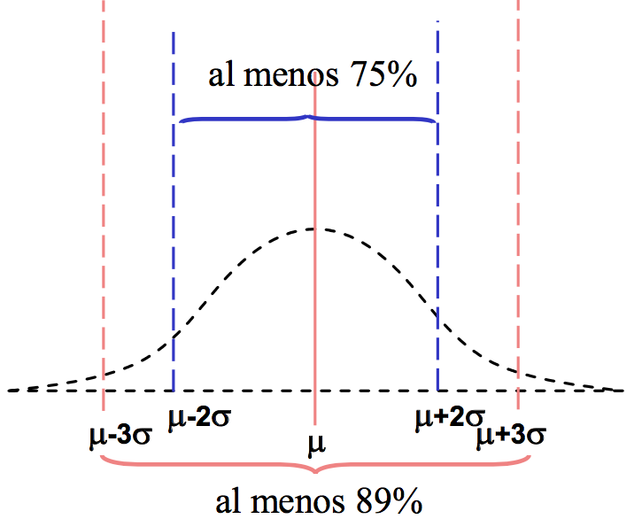

\newpage

[Regresar a la página principal](https://idaejin.github.io/datahack/)


# Concepto de Variable Aleatoria

En ocasiones, describir todos los posibles resultados de un experimento aleatorio no es suficiente. 

  + Lanzar una moneda 3 veces: $\{(CCC), (CCX), ...\}$
  + Lanzar un dado dos veces: $\{(1,1), (1,2), (1,3), ...\}$

A veces es útil asociar un número a cada resultado del experimento $\rightarrow$ Definir una variable

No conocemos el resultado del experimento antes de realizarlo

No conocemos el valor que va a tomar la variable antes del experimento

$\rightarrow$ **Variable Aleatoria**


*Ejemplo:*
 
  + Lanzar una moneda 3 veces: $\{(CCC), (CCX), ...\}$
  $$
      X = \mbox{``Nº de Caras en el 1er lanzamiento $X[(CCC)]=1,X[(XCX)=0,...]$''}
  $$
 
  + Lanzar un dado dos veces: $\{(1,1), (1,2), (1,3), ...\}$
    
  $$
      Y = \mbox{``Suma de puntuaciones $Y[(1,1)]=2,Y[(1,2)]=3,...$''}
  $$
  
Una *variable aleatoria* es una función que asocia un número real a cada elemento del espacio muestral.

Las variables aleatorias se representan por letras mayúsculas, normalmente empezando por el final del alfabeto: X,Y, Z, etc.

Los posibles valores que puede tomar la variable se representan por letras minúsculas, ej: $x=1$ es un posible valor de la v.a. $X$.


**Ejemplos:**

  + Número de unidades defectuosas en una muestra aleatoria de 5 unidades

  + Número de defectos superficiales en un $cm^2$ de cierto material

  + Tiempo de duración de una bombilla

  + Resistencia a la compresión de un material de construcción
  

## Variables aleatorias discretas y contínuas

El rango de una variable aleatoria es el conjunto de valores que puede tomar la variable.

Atendiendo al rango las variables se pueden clasificar como:

  + Variables aleatorias discretas: Aquellas en las que el rango es finito infinito numerable.
  + Variables aleatorias continuas: Aquellas en las que el rango es un intervalo de números reales.
    
### Variables aleatorias discretas

Los valores de una variable aleatoria cambian de un experimento a otro al cambiar los resultados del experimento. Una variable aleatoria está definida por:

  + los valores que toma
  + la probabilidad de tomar cada uno esos valores
  
  
  **Función de probabilidad**
  es una función que indica la probabilidad de cada valor
  
  $$
      p(x_i) = P(X=x_i)
  $$

*Ejemplo:*

  + Tiramos una moneda 3 veces. Representamos cara por c y cruz por z.
        $$
        W = \{ccc, ccz, czc, zcc, czz, zcz, zzc, zzz\}
        $$
        
*La probabilidad de cada suceso elemental es $1/8$. Por ejemplo $p(ccc)=1/8$, ya que la probabilidad de sacar cara en una tirada es $1/2$ según la definición clásica y las tiradas son independientes.*

*Definimos la v.a. X=número de caras, que puede tomar los valores {0, 1, 2, 3}. Se buscan todos los puntos muestrales que dan lugar a cada valor de la variable y a ese valor se le asigna la probabilidad del suceso correspondiente.*

X        | Sucesos          | P(X=x)
-------- | ---------------- | ---------
      0  | {zzz}            |   1/8
      1  | {czz, zcz, zzc}  |   3/8
      2  | {ccz, czc, zcc}  |   3/8
      3  | {ccc}            |   1/8


En ocasiones nos puede interesar la probabilidad de que una variable tome un valor menor o igual que una cantidad (**Función de probabilidad**)

$$
F_n(X) = P(X\leq x_n) 
$$

En ejemplo anterior:

X        | Sucesos          | F(X)
-------- | ---------------- | ---------
      0  | {zzz}            |   1/8
      1  | {czz, zcz, zzc}  |   4/8
      2  | {ccz, czc, zcc}  |   7/8
      3  | {ccc}            |   1


### Variables aleatorias continuas

**Función de densidad $f(x)$** describe la distribución de probabilidad de una variable continua. Es una función continua que verifica:

  + $f(x) \geq 0$
  
  + $\int_{-\infty}^{\infty}f(x)dx=1$
  
  + $P(a \leq X \leq b) = \int_b^a f(x)dx$
  
**Función de distribución** 

$$
    F(x) = P(X\leq x) = \int_{-\infty}^{x} f(u)du \qquad -\infty < x < \infty
$$

En el caso discreto la diferencia entre dos valores consecutivos de F(x) proporcionan la función de probabilidad. En el caso de variables continuas:

$$  
    f(x) = \frac{d F(x)}{dx}
$$


**Propiedades:**

  + $a<b \rightarrow F(a) \leq F(b)$ es no decreciente
    
  + $F(-\infty) = P(X\leq -\infty) = \int_{-\infty}^{\infty}  = 0$; $F(+\infty) = P(X\leq +\infty) = \int_{-\infty}^{\infty}  = 1$, es contínua
    

# Medidas características de una variable aleatoria

La media $\mu$ o Esperanza matemática $E$

  +  $\mu = E(X) = \sum_{i} x_i p(x_i)$ \qquad (v.a. discreta)
    
  +  $\mu = E(X) = \int_{-\infty}^{\infty} x f(x)dx$ \qquad (v.a. contínua)

La **Varianza**

$$
    Var[X] = E\left[ (X-E[X])^2\right]  = E[X^2] - (E[X])^2
$$

### Desigualdad de Chebyshev

Si X es una variable aleatoria con:

$\mu=E[X]$ y $\sigma^2 = Var[X]$


Se puede demostrar que gran parte de la distribución está situada en un intervalo centrado en $\mu$ y que tiene una amplitud varias veces $\sigma$. En concreto:

$$
\forall k>0 \quad P(\mu - k \sigma \leq X \leq \mu + k \sigma) \geq 1-\frac{1}{k^2}
$$

Es decir, la probabilidad de realizar una observación de una variable y que esté en ese intervalo es mayor o igual que $1-\frac{1}{k^2}$

<center>{width=65%}</center>

Sea

$m_k = E[X^k]$ el momento de order $k$ respecto al origen

$\mu_k = E[(X-\mu)^k]$ el momento de order $k$ respecto a la media


**Coeficiente de asimetría**

$CA = \frac{\mu_3}{\sigma^3}$

**Coeficiente de apuntamiento**

$CA_p = \frac{\mu_4}{\sigma^4}$ ó $\frac{\mu_4}{\sigma^4}-3$


### Transformaciones lineales de variables aleatorias

Sea $Y = a + bX$

$E[Y] = a + b E[X]$ 
$Var[Y] = b^2 Var[X]$


# Distribuciones de Probabilidad

## Distribución Binomial $Bin(n,p)$

 La variable aleatoria binomial, $X$, expresa el número de éxitos obtenidos en cada prueba del experimento.
 
 + En cada prueba del experimento sólo son posibles dos resultados: 
 
 + La probabilidad del suceso A es constante, es decir, que no varía de una prueba a otra. Se representa por p.
 
 + El resultado obtenido en cada prueba es independiente de los resultados obtenidos anteriormente. 


La distribución Binomial es una distribución de probabilidad discreta, que describe el resultado de un experimento de $n$ pruebas independientes. Cada prueba se asume que tiene dos posibles valores. si la probabilidad de éxito es $p$, entonces la probabilidad de obtener $k$ éxitos de un experimento con $n$ pruebas independientes viene dado por la **función de masa de probabilidad**:

$$
f(k,n,p) = \mbox{Pr}(X=k)=\binom{n}{k} p^k (1-p)^{n-k}, \quad k=0,1,2,...,n
$$

La **función acumulativa de distribución** es:

$$
F(k;n,p) = \mbox{Pr}(X\leq k) = \sum_{i=0}^{k}\binom{n}{i} p^i (1-p)^{n-i}
$$
```{r, echo=FALSE,fig.width=10,fig.height=8}
library(RColorBrewer)
cols <- brewer.pal(4,"Set1")
sizes <- c(20,20,40)
probs <- c(0.5,0.7,0.5)
x <- seq(0,40,by=1)
pdfsimul <- matrix(NA,length(x),length(sizes))
cumsimul <- matrix(NA,length(x),length(sizes))
for(i in 1:3){
  pdfsimul[,i] <- dbinom(x,size=sizes[i],prob=probs[i])
  cumsimul[,i] <- pbinom(x,size=sizes[i],prob=probs[i])
}
par(mfrow=c(1,2))
matplot(x,pdfsimul,t='h',lty=1,lwd=2,col=cols,xlab="x",ylab="P(X=k)",main="Prob Mass Function")
legend("left",lty=1,legend=c("p=0.5 and N=20","p=0.7 and N=20","p=0.5 and N=40"),col=cols,lwd=2,cex=.75,horiz=FALSE, inset=0.5,box.lwd=0)
matplot(x,cumsimul,pch=8,lty=1,lwd=1,col=cols,xlab="x",ylab=expression(P(X=x)))
legend("left",pch=8,legend=c("p=0.5 and N=20","p=0.7 and N=20","p=0.5 and N=40"),col=cols,cex=.75,horiz=FALSE, inset=0.5,box.lwd=0)
```

con *media* $np$ y *varianza* $np(1-p)$.


**Pregunta:**

Supongamos que en un examen de matemáticas hay 12 preguntas de respuesta múltiple. Cada una de las pregunras tiene 5 posibles respuestas de las cuáles tan sólo una de ellas es correcta. 

+ ¿Cuál es la probabilidad de obtener 4 o menos respuestas correctas si un estudiante contesta al azar?

<!--
*Solution*

Since only one out of five possible answers is correct, the probability of answering a question correctly by random is $1/5=0.2$. We can find the probability of having exactly 4 correct answers by random attempts as follows. 

```{r}
p = 1/5
n = 12
k = 4
dbinom(k,size=n,prob=0.2)
```

To find the probability of having four or less correct answers by random attempts, we apply the function `dbinom` with `k=0,1,2,4`.
```{r}
prob <- NULL
for(k in 0:4){
prob <- c(prob,dbinom(k,n,p))
prob
}
prob
sum(prob)

# or simply
sum(dbinom(0:4,n,p))
```

Alternative, we can use the cumulative probability function for the binomial distribution `pbinom`
```{r}
pbinom(4,size=n,prob=0.2)
```

**Answer:** the probability of four or less questions answered correctly by random in a twelve question multiple choice quiz is 92.7%. 
-->

+ ¿Cuál es la probabilidad de que el alumno tenga 2 ó 3 respuestas correctas?

<!--
```{r}
sum(dbinom(2:3,n,p))
```
-->

**Pregunta:** 

Supongamos que la empresa *A* produce el producto *B* con una probabilidad de 0,005 de productos defectuosos. Supón que el prodcuto *B* se distribuye en lotes de 25 items. ¿Cuál es la probabilidad de que un lote seleccionado al azar tenga exactamente 1 producto defectuoso? ¿Cuál es la probabilidad de que un lote seleccionado al azar no tenga más de un item defectuoso?

**Soluciones [aquí](IntroSM_sol.html)**

## Distribución de Poisson $Pois(\lambda)$

La distribución de Poisson hace referencia a la modelización de situaciones en las que nos interesa determinar el número de hechos de cierto tipo que se pueden producir en un intervalo de tiempo o de espacio. Si el parámetro $\lambda$ es la media de sucesos por intervalo, la probabilidad de tener $k$ sucesos en el intervalo, se define como la función de probabilidad de masa:

$$
\mbox{Pr}(\mbox{$k$ sucesos en el intervalo}) = \frac{\lambda^k e^{-\lambda}}{k!}
$$

La **función de densidad acumulada** es
$$
P(X\leq x ~|~\lambda ) = \frac{e^{-\lambda} \lambda ^x}{x!}\quad \mbox{for $x=0,1,2,...$}
$$


```{r, echo=FALSE,fig.width=10,fig.height=8}
library(RColorBrewer)
cols <- brewer.pal(4,"Set1")
la <- c(1,4,10)
x <- seq(0,40,by=1)
pdfsimul <- matrix(NA,length(x),length(sizes))
cumsimul <- matrix(NA,length(x),length(sizes))
for(i in 1:3){
  pdfsimul[,i] <- dpois(x,lambda=la[i])
  cumsimul[,i] <- ppois(x,lambda=la[i])
}
par(mfrow=c(1,2))
matplot(x,pdfsimul,t='b',pch=8,lwd=2,col=cols,xlab="x",ylab="P(X=k)",main="Prob Mass Function")
legend("left",lty=1,legend=c(expression(lambda==1),expression(lambda==4),expression(lambda==10)),col=cols,lwd=2,cex=.75,horiz=FALSE, inset=0.5,box.lwd=0)
matplot(x,cumsimul,pch=8,lty=1,lwd=1,col=cols,xlab="x",ylab=expression(P(X<=k)), main="Cumulative Distribution Function")
legend("left",pch=8,legend=c(expression(lambda==1),expression(lambda==4),expression(lambda==10)),col=cols,cex=.75,horiz=FALSE, inset=0.5,box.lwd=0)
```

**Pregunta:** 

Supongamos que el número de insectos en una plantación de un metro cuadrado, viene dada por una distribución de Poisson de media $\lambda= 10$. Calcula la probabilidad de encontrar exactamente $12$ insectos en una parcela de 1 $m^2$.

```{r,echo=FALSE}
dpois(12,lambda=10)
```


**Pregunta:** 
Si hay 12 coches cruzando un puente por minuto en media. Calcula la probabilidad de encontrar 17 ó más coches cruzando el puente en un minuto cualquiera.

**Soluciones [aquí](IntroSM_sol.html)**


## Aproximación de la Binomial y la Poisson

**Ejemplo:**

El 5% de las bombillas de un árbol de navidad manufacturado por una compañia son defectuosas. El gerente del departamento de Control de calidad de la empresa está preocupado y ha seleccionado 100 bombillas de la cadena de montaje. Sea $X$ el número de bombillas defectuosas. ¿Cuál es la probabilidad de que la muestra de 100 bombillas tenga a lo sumo 3 bombillas defectuosas?

```{r}
p = 0.05
k = 3
n = 100
pbinom(k,size=n,prob=p)
```

Se puede demostrar que la distribución Binomial se puede aproximar mediante la distribución de Poisson cuando $n$ es grande. Mediante la distribución de Poisson, la media es $\lambda = np$

```{r}
lambda <- n*p
sum(dpois(0:3,lambda))
```

Esta aproximación  es válida con $n$ grande y $p$ pequeño. En general, con $n \geq 20$ y $p\leq0.05$, o bien cuando $n\geq 100$ y $p\leq 0.10$.

## Distribucion exponencial $Exp(\lambda)$

La distribución Exponencial mide la probabilidad de que una variable aleatoria que describe el tiempo entre eventos de un proceso de Poisson, es decir un  proceso que ocurre de manera contínua e independiente a una tasa constante. Es un caso particular de la distribución Gamma y el análogo contínua de la distribución geométrica y tiene la propiedad de falta de memoria.


La funcion de densidad de probabilidad es
$$
f(x;\lambda) =  \lambda \exp(-\lambda x)
$$

donde $\lambda>0$ es la tasa del evento (también  conocido tasa de llegadas, tasa de transición etc ...). Un variable aleatoria Exponencial: $x \in [0,\infty)$
```{r,echo=FALSE, fig.width=10,fig.height=8}
library(RColorBrewer)
cols <- brewer.pal(4,"Set1")
pdfsimul <- matrix(NA,200,3)
cumsimul <- matrix(NA,200,3)
la <- c(.5,1,1.5)
for(i in 1:3){
  pdfsimul[,i] <- dexp(seq(0,5,l=200),rate=la[i])
  cumsimul[,i] <- pexp(seq(0,5,l=200),rate=la[i])
}
par(mfrow=c(1,2))
matplot(seq(0,5,l=200),pdfsimul,t='l',lty=1,lwd=2,col=cols,xlab="x",ylab="",main="Probability Density Function")
legend("left",lty=1,legend=c(expression(lambda==0.5),expression(lambda==1.0),expression(lambda==1.5)),col=cols,lwd=2,cex=1.,horiz=FALSE, inset=0.5,box.lwd=0)
matplot(seq(0,5,l=200),cumsimul,t='l',lty=1,lwd=2,col=cols,xlab="x",ylab=expression(P(X<=x)),main="Cumulative Distribution Function")
legend("left",lty=1,legend=c(expression(lambda==0.5),expression(lambda==1.0),expression(lambda==1.5)),col=cols,lwd=2,cex=1.,horiz=FALSE, inset=0.5,box.lwd=0)
```

La función de distribución acumulada es
$$
F(x) = \mbox{Pr}(X\leq x) = 
  \left\{
    \begin{array}{lcc}
      1- e^{-\lambda x} & & x\geq 0 \\
      0                 & & x < 0
    \end{array}
  \right.
$$

La media $\mathbb{E}(X) = 1/\lambda$, y $\mathbb{V}ar(X) = 1/\lambda^2$.

**Pregunta:**
Supongamos que la cantidad de tiempo que los clientes de un banco pasan en él se distribuye como una exponencial con media 10 minutos, por tanto $\lambda=1/10$. 

- ¿Cuál es la probabilidad de que un cliente pase más de 15 minutos en el banco? 
- ¿Cuál es la probabilidad de que un cliente pase más de 15 minutos en el banco dado que sigue en el banco después  de 10 minutos?


**Soluciones [aquí](IntroSM_sol.html)**


## Distribución Normal $\mathcal{N}(\mu,\sigma^2)$

La función de densidad es

$$
f(x | \mu,\sigma^2) = \frac{1}{\sqrt{2\sigma^2\pi}} e ^{-\frac{(x-\mu)^2}{2\sigma^2}},
$$
donde

- $\mu$ es la media  (tambien mediana y moda).
- $\sigma$ es la desviación  estándar ($\sigma>0$).
- $\sigma^2$ la varianza.

El proceso de estandarización de la distribución Normal, consiste en transformar una variable $N(\mu,\sigma)$ en $N(0,1)$, i.e.
$$
Z = \frac{X-\mu}{\sigma} \sim N(0,1)
$$

```{r, echo=FALSE,fig.width=10,fig.height=8}
library(RColorBrewer)
cols <- brewer.pal(4,"Set1")
 means <- c(-2,0,0,0)
sigmas <- sqrt(c(.5,5,1,.2))
pdfsimul <- matrix(NA,200,4)
cumsimul <- matrix(NA,200,4)
x <- seq(-5,5,l=200)
for(i in 1:4){
  pdfsimul[,i] <- dnorm(x,mean=means[i],sd=sigmas[i])
  cumsimul[,i] <- pnorm(x,mean=means[i],sd=sigmas[i])
}
par(mfrow=c(1,2))
matplot(x,pdfsimul,t='l',lty=1,lwd=2,col=cols,xlab="x",ylab="", main="Probability Density Function")
legend(1.55,0.8,lty=1,legend=c(expression(mu==-2,sigma^2==0.5),expression(mu==0,sigma^2==5),expression(mu==0,sigma^2==1),expression(mu==0,sigma^2==0.2)),col=c(cols[1],"white",cols[2],"white",cols[3],"white",cols[4],"white"),lwd=2,cex=1.,horiz=FALSE, inset=0.5,box.lwd=0)
matplot(x,cumsimul,t='l',lty=1,lwd=2,col=cols,xlab="x",ylab=expression(P(X<=x)), main ="Cumulative Distribution Function")
legend(1.55,0.6,lty=1,legend=c(expression(mu==-2,sigma^2==0.5),expression(mu==0,sigma^2==5),expression(mu==0,sigma^2==1),expression(mu==0,sigma^2==0.2)),col=c(cols[1],"white",cols[2],"white",cols[3],"white",cols[4],"white"),lwd=2,cex=1.,horiz=FALSE, inset=0.5,box.lwd=0)
```


**Pregunta:**

Sea $X$ una variable aleatoria distribuida como una Normal con media $\mu = 30$ y desviación estandard $\sigma = 4$. Calcula

a) $P(x<40)$

b) $P(x>21)$

c) $P(30<x<35)$

**Pregunta:**

El acceso a una Universdad viene dado por un examen a nivel Nacional. Las puntuaciones de este examen se distribuyen mediante una distribución Normal con media 500 y desviación estandard de 100. Tomás quiere ser admitido a esta universidad y sabe que debe obtener una nota media superior al 70% de los estudiantes que hicieron el examen. Tomás sacó una nota de 585. ¿Será admitido?


**Soluciones [aquí](IntroSM_sol.html)**


<!-- ## Uniform distribution -->

<!-- ## Gamma distribution -->

<!-- ## Beta distribution -->


<!-- # Central Limit Theorem -->

<!-- ```{r} -->
<!-- library(TeachingDemos) -->
<!-- clt.examp(5) -->
<!-- clt.examp(50) -->
<!-- ``` -->

<!-- # Estimation -->

<!--
## Ejercicios:

1. A dice is thrown at random. What is the expectation of number on it? (Or) If x denotes the number of points on a dice, find the expectation and the variance of x.

```{r}
x = 1:6
prob <- 1/6

 E  <- sum(x*rep(prob,length(x)))
 
 E2 <- E^2
 Ex2 <- sum(x^2*rep(prob,length(x)))
Var <- Ex2-E2
```

2. If a person gains or loses an amount equal to the number appearing when a balanced die is rolled once, according to whether the number is even or odd, how much money can be expect per game in the long run? 


Let $x$ indicate the amount that the person wins 

The amount gained by the person would be

-  `- Rs. 1` if the dice shows up ONE
-  `+ Rs. 2` if the dice shows up TWO
-  `- Rs. 3` if the dice shows up THREE
-  `+ Rs. 4` if the dice shows up FOUR
-  `- Rs. 5` if the dice shows up FIVE
-  `+ Rs. 6` if the dice shows up SIX


```{r}
x = c(1:6)*c(-1,1,-1,1,-1,1)
pr <- rep(1/6,6)
 Ex <- sum(x*pr)
Ex2 <- sum(x^2*pr)
Var <- Ex2-Ex^2
Ex
Var
```
-->

